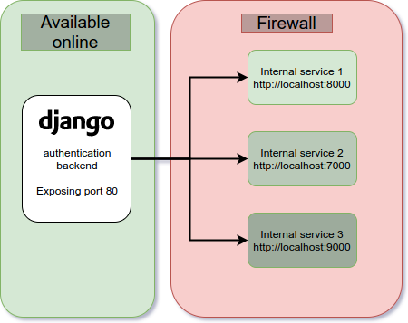

# reverse-proxy

Django based reverse proxy application that implements common user authentication
backend for multiple internally running services behind the firewall.

## How it works

Django handles the users and authentication logic and redirects to the user specified
endpoints if user is authenticated.



The proxy can operate in two different modes. `Subdomain` based mode and `Plain`
mode. Those modes can operate in parallel.

### Subdomain mode
This mode requires to setup different subdomains per proxied service not only
the `ProxySite` entries. The benefit of this configuration is that multiple
proxies can be visited at the same time.

### Plain mode
Requires only `ProxySite` database entries so the setup is easier. The downside
is that only one proxied service can be visited at once.


## How to run

### Development / tests

For tests and development use `docker-compose` for convenience.

```bash
$ docker-compose run --rm server-dev
```

To check the running container, navigate to the container `ip` on port 8000.
You can find the container `ip` with `docker inspect <container_name>`.

For the `Subdomain` mode it's useful to create a few aliases in the `/etc/hosts`
file and test the subdomain logic there.

### Production
For production, run straight with docker command.

```bash
$ docker build -t "reverse_proxy:latest" .
$ docker run -p 80:80 \
  -e "ENVIRONMENT=production" \
  -e "SECRET_KEY=<super-secret-key>" \
  -e "SESSION_COOKIE_DOMAIN=<session-cookie-domain>" \
  -e "SESSION_COOKIE_SECURE=<session-cookie-secure>" \
  -e "ADMIN_USERNAME=<admin_username>" \
  -e "ADMIN_PASSWORD=<admin_password>" \
  -e "ADMIN_EMAIL=<admin_email>" \
  -e "EMAIL_HOST=<email_host>" \
  -e "EMAIL_HOST_USER=<email_host_user>" \
  -e "EMAIL_HOST_PASSWORD=<email_host_password>" \
  -e "EMAIL_PORT=<email_port>" \
  -e "EMAIL_USE_TLS=<email_use_tls>" \
  -v "/local/drive/location:/src/data" \
  reverse_proxy
```

`SECRET_KEY` is the key used for encrypting the passwords so you should keep
is secure [rel: Django docs](https://docs.djangoproject.com/en/1.11/ref/settings/#std:setting-SECRET_KEY).

`SESSION_COOKIE_DOMAIN` can be omitted if `Subdomain` mode is not used, it allows
for keeping the session cookies on multiple subdomains [rel: Django docs](https://docs.djangoproject.com/en/1.11/ref/settings/#std:setting-SESSION_COOKIE_DOMAIN).

`SESSION_COOKIE_SECURE` specifies whether to use a secure cookie for the session
cookie [rel: Django docs](https://docs.djangoproject.com/en/1.11/ref/settings/#session-cookie-secure).

Visit the url to login to the proxy.

### Persist the data

To keep the data on the host, mount your directory of choice to `/src/data`.

```bash
$ docker run -p 80:80 -v "/local/drive/location:/src/data"
```
